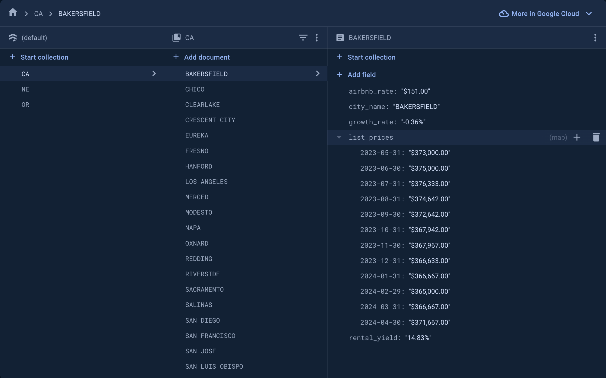

## PyBnB -  Real Estate Analytics Tool

PyBnB is a powerful Python application designed to empower real estate investors with valuable insights into property investment opportunities across the United States. Leveraging real-time data from Zillow and Airbnb, PyBnB fetches and analyzes property data for cities nationwide, providing investors with key metrics including property growth rates, gross rental yields, average Airbnb rates, and median listing prices from the preceding 12 months.



Note: This example demonstrates the usage on CA, OR, and NE only. You can run it on any state you want.

### Built With

1. Firebase
2. Pandas
3. Python
4. Selenium
   
## Getting Started

### Installation

1. Clone the Repository:
   
   * Clone the repository using the following command:
   ```sh
   git clone https://github.com/kdluong/PyBnB.git
   ```
     
2. [Optional, but recommended] Set up and activate a virtual environment to isolate project dependencies:
   
   ```sh   
   pip3 install virtualenv        # Install virtual environment
   virtualenv myenv               # Create virtual environment

   source myenv/bin/activate      # Activate virtual environment (MacOS)
   myenv/bin/activate             # Activate virtual environment (Windows)
   ```
      
3. Install project dependencies listed in requirements.txt:
   
    ```sh
    pip3 install -r requirements.txt
    ```
    
4. [Optional] If you wish to integrate Firebase for data uploading, create a file named credentials.json and put it in the root folder. Then, paste your Firebase credentials into this file.
   
5. Run! 

   ```sh
    python src/main.py
    ```
   
## Contributing

If you have a suggestion that would make this better, please fork the repo and create a pull request. You can also simply open an issue with the tag "enhancement". Don't forget to give the project a star! Thanks again!

1. Fork the Project
2. Create your Feature Branch (`git checkout -b feature/AmazingFeature`)
3. Commit your Changes (`git commit -m 'Add some AmazingFeature'`)
4. Push to the Branch (`git push origin feature/AmazingFeature`)
5. Open a Pull Request
